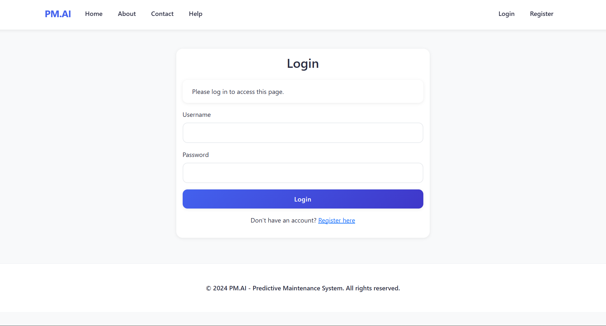
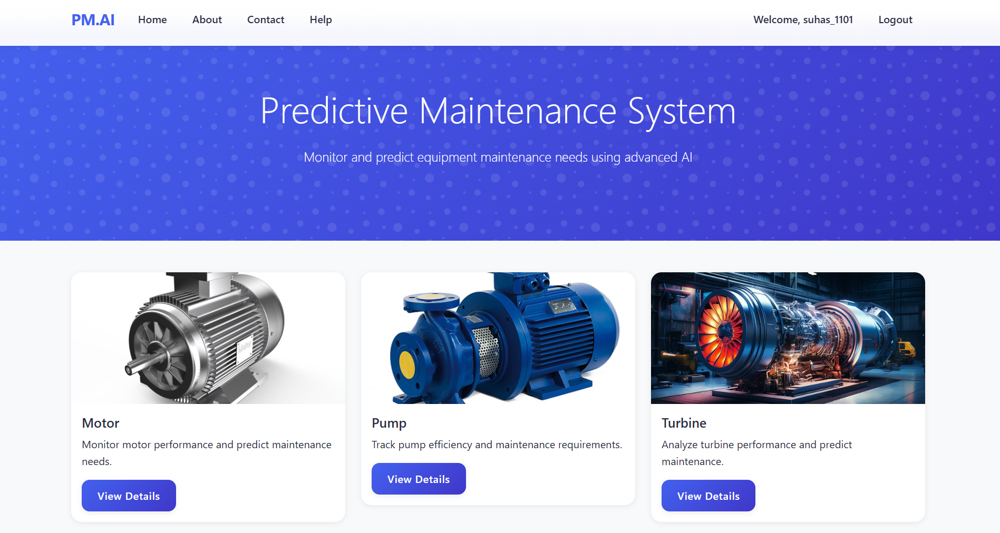
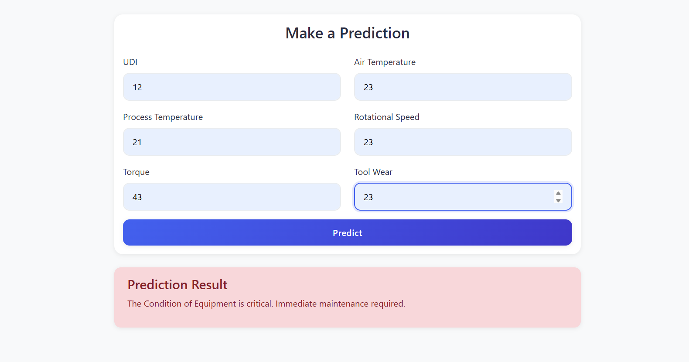
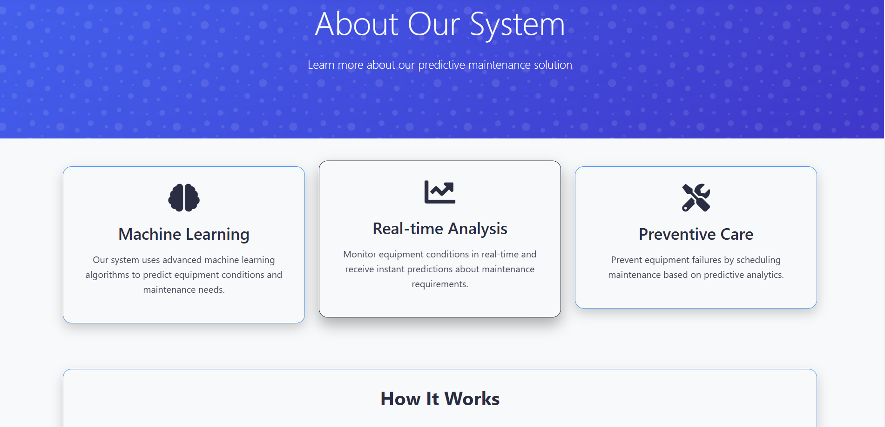
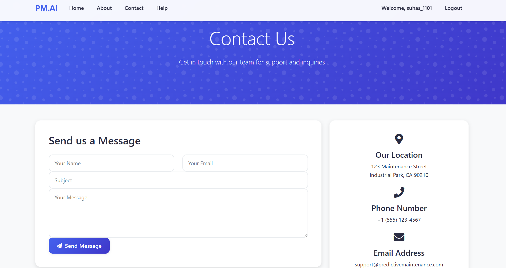
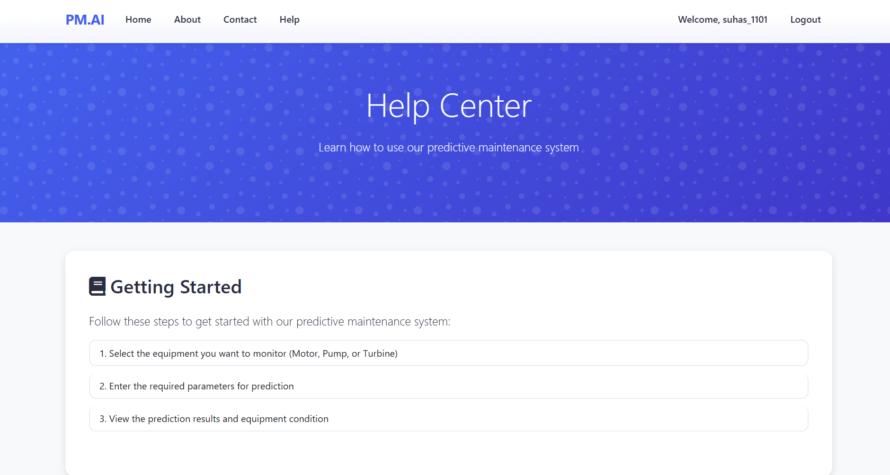

# Predictive Maintenance Analysis System

A web-based predictive maintenance system that uses machine learning to predict equipment maintenance requirements based on real-time sensor data. This system helps prevent equipment failures by analyzing various parameters and providing maintenance recommendations.

## 🚀 Features

- **Machine Learning Predictions**: Uses Random Forest algorithm to predict equipment conditions
- **Real-time Analysis**: Monitor equipment parameters in real-time
- **User Authentication**: Secure login and registration system
- **Interactive Web Interface**: Modern, responsive web application
- **MongoDB Integration**: Scalable database for user management and data storage
- **Predictive Analytics**: Analyze multiple equipment parameters:
  - Air Temperature
  - Process Temperature
  - Rotational Speed
  - Torque
  - Tool Wear

## 📸 Screenshots

### Authentication Login and Signup

*Authentication using Mongodb atlas*

### Dashboard Interface

*Main dashboard showing the predictive maintenance interface*

### Prediction Results

*Real-time prediction results and analysis*

### About Page

*About Page*

### Contact Us and Help page


*Contact US and Help page*

## 🛠️ Technology Stack

- **Backend**: Flask (Python web framework)
- **Frontend**: HTML, CSS, JavaScript, Bootstrap
- **Database**: MongoDB
- **Machine Learning**: Scikit-learn, Random Forest
- **Authentication**: Flask-Login
- **Deployment**: Gunicorn (production server)

## 📋 Prerequisites

Before running this application, make sure you have:

- Python 3.8 or higher
- MongoDB database (local or cloud)
- pip (Python package installer)

## 🔧 Installation

1. **Clone the repository**
   ```bash
   git clone <repository-url>
   cd Builtup_predictive_Analysis
   ```

2. **Create and activate virtual environment**
   ```bash
   python -m venv myenv
   
   # On Windows
   myenv\Scripts\activate
   
   # On macOS/Linux
   source myenv/bin/activate
   ```

3. **Install dependencies**
   ```bash
   pip install -r requirements.txt
   ```

4. **Set up environment variables**
   Create a `.env` file in the root directory with the following variables:
   ```env
   MONGODB_URI=your_mongodb_connection_string
   SECRET_KEY=your_secret_key_here
   ```

5. **Prepare the database**
   - Ensure MongoDB is running
   - The application will automatically create necessary collections

## 🚀 Running the Application

### Development Mode
```bash
python app.py
```

### Production Mode
```bash
gunicorn app:app
```

The application will be available at `http://localhost:5000`

## 📊 Usage

1. **Registration**: Create a new account with username, email, and password
2. **Login**: Access the system with your credentials
3. **Input Parameters**: Enter equipment sensor data:
   - UDI (Unique Device Identifier)
   - Air Temperature
   - Process Temperature
   - Rotational Speed
   - Torque
   - Tool Wear
4. **Get Predictions**: Receive maintenance predictions based on the input data
5. **View Results**: Analyze the predicted equipment condition and maintenance recommendations

## 📁 Project Structure

```
Builtup_predictive_Analysis/
├── app.py                 # Main Flask application
├── requirements.txt       # Python dependencies
├── rf_model.pkl          # Trained Random Forest model
├── st_scaler.pkl         # Standard scaler for data preprocessing
├── data/
│   └── predictive_maintenance.csv  # Training dataset
├── templates/            # HTML templates
│   ├── base.html         # Base template
│   ├── index.html        # Main dashboard
│   ├── login.html        # Login page
│   ├── register.html     # Registration page
│   └── ...              # Other template files
├── static/              # Static files (CSS, JS, images)
├── myenv/               # Virtual environment
└── .gitignore          # Git ignore file
```

## 🔍 Model Information

The system uses a **Random Forest** classifier trained on historical equipment data. The model analyzes six key parameters to predict equipment conditions:

- **UDI**: Unique Device Identifier
- **Air Temperature**: Ambient air temperature
- **Process Temperature**: Temperature during the manufacturing process
- **Rotational Speed**: Speed of rotating components
- **Torque**: Rotational force applied
- **Tool Wear**: Wear level of tools

## 🛡️ Security Features

- Password hashing using Werkzeug
- Session management with Flask-Login
- Environment variable configuration
- Input validation and sanitization

## 📈 API Endpoints

- `GET /` - Main dashboard (requires authentication)
- `GET /login` - Login page
- `POST /login` - Login authentication
- `GET /register` - Registration page
- `POST /register` - User registration
- `POST /predict` - Get maintenance predictions
- `GET /logout` - User logout
- `GET /about` - About page
- `GET /help` - Help documentation
- `GET /contact` - Contact information

## 🔧 Configuration

### Environment Variables

| Variable | Description | Required |
|----------|-------------|----------|
| `MONGODB_URI` | MongoDB connection string | Yes |
| `SECRET_KEY` | Flask secret key for sessions | Yes |

### Model Files

The application requires two pre-trained model files:
- `rf_model.pkl`: Random Forest classifier
- `st_scaler.pkl`: Standard scaler for feature normalization

## 🚀 Deployment

### Local Development
```bash
python app.py
```

### Production Deployment
```bash
gunicorn --bind 0.0.0.0:8000 app:app
```

### Docker Deployment (Optional)
```dockerfile
FROM python:3.9-slim
WORKDIR /app
COPY requirements.txt .
RUN pip install -r requirements.txt
COPY . .
EXPOSE 8000
CMD ["gunicorn", "--bind", "0.0.0.0:8000", "app:app"]
```

## 🤝 Contributing

1. Fork the repository
2. Create a feature branch (`git checkout -b feature/AmazingFeature`)
3. Commit your changes (`git commit -m 'Add some AmazingFeature'`)
4. Push to the branch (`git push origin feature/AmazingFeature`)
5. Open a Pull Request

## 📝 License

This project is licensed under the MIT License - see the LICENSE file for details.

## 📞 Support

For support and questions:
- Check the Help section in the application
- Review the documentation
- Contact the development team

## 🔄 Updates

- **v1.0.0**: Initial release with basic predictive maintenance functionality
- User authentication system
- Random Forest model integration
- Web-based interface

---

**Note**: This system is designed for educational and demonstration purposes. For production use, ensure proper security measures and model validation are implemented. 